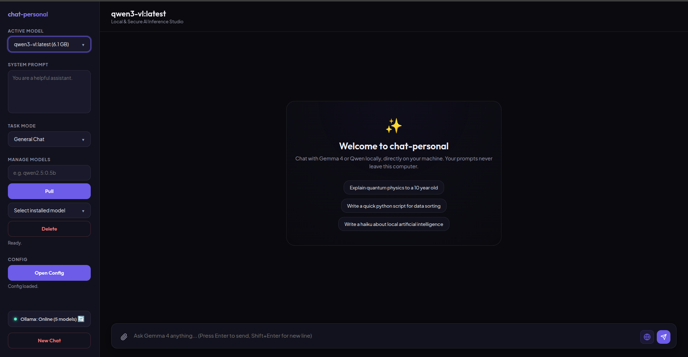
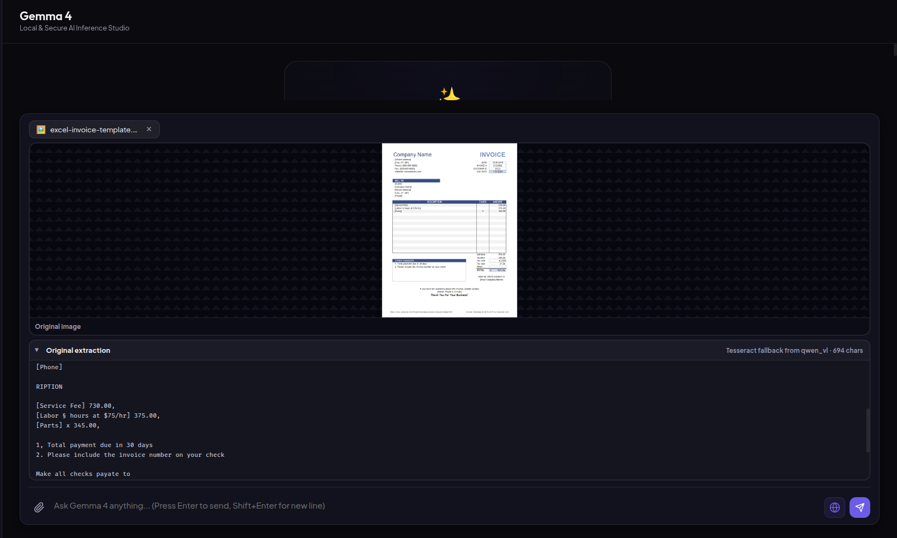
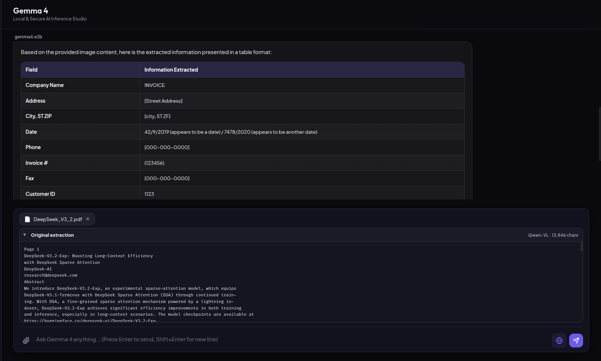
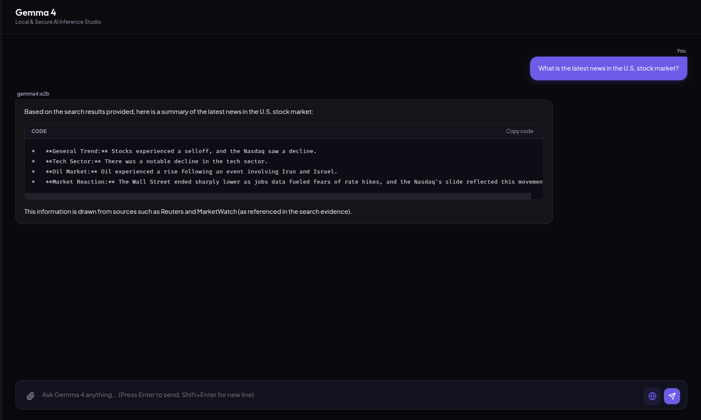
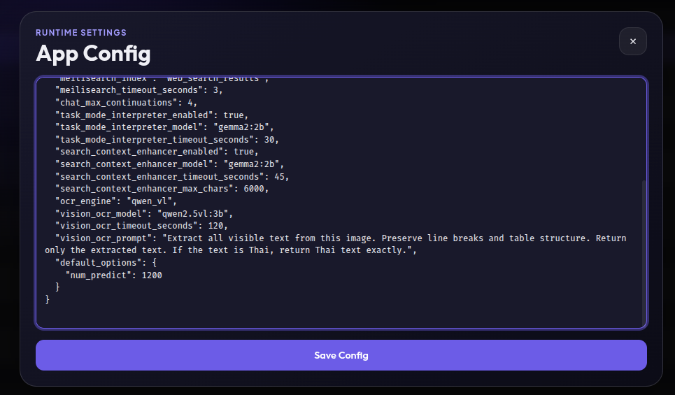

# Local LLM Studio

Docker-based local AI chat studio with Ollama, a FastAPI gateway, a browser UI, file upload extraction, OCR, web search, task-mode routing, and persistent chat memory.

## Features

- Local chat through Ollama models.
- Browser UI served by Nginx at `http://127.0.0.1:8000`.
- FastAPI backend gateway for chat, model management, uploads, config, task mode, and search.
- GPU-requested Ollama runtime through Docker Compose NVIDIA device reservations.
- Automatic first-run default model bootstrap when no model is installed.
- Sidebar model management for listing, pulling, selecting, and deleting Ollama models.
- Runtime config editor from the UI.
- Task modes: `general`, `code_writer`, `code_reviewer`, `code_editor`, and `bug_fixer`.
- Small-model task-mode inference before chat requests.
- Auto web search for current information.
- Combined search provider mode using SearXNG, legacy web providers, and Meilisearch cached results.
- Small-model search context enhancement for cleaner grounded search briefs.
- Direct website context extraction when a prompt contains an `http` or `https` URL.
- File upload support for PDF, DOCX, XLSX, XLS, TXT, MD, JSON, CSV, JPG, JPEG, and PNG.
- PDF extraction with fast embedded-text detection, Docling document parsing, Surya OCR, and legacy fallback.
- Qwen-VL OCR through Ollama for image uploads and scanned PDF pages.
- Qwen-VL OCR requests `num_gpu: 999` so Ollama uses GPU when the Ollama container can see NVIDIA GPU.
- Tesseract fallback when vision OCR fails.
- Original extraction preview in the chat UI.
- Upload progress status while OCR or parsing is running.
- Uploaded-file prompts are isolated from earlier chat history.
- Persistent chat memory with idle-session summaries and future prompt injection.
- Optional skill markdown injection from `backend/skill/*.md`.

## Feature Screenshots

video example: [video overview](https://drive.google.com/file/d/17oqKH3b8yyg8zrWMchJtqxqcxxl9Ok73/view?usp=sharing)

### Web Overview and Model Management



The web UI supports local chat, active model selection, pulling new Ollama models, and deleting installed models.

### OCR for Images and PDFs



The app supports OCR for image and PDF uploads, then sends the extracted context to the selected model.

### File Context Summarization



Uploaded files can be summarized or analyzed using their extracted text context.

### Web Search and Data Summarization



The app can search for external information, combine relevant results, and summarize the data for the selected model.

### Runtime Configuration



The project is driven by runtime configuration, including model defaults, OCR settings, web search, and task-mode behavior.

## Architecture

- `ollama`: local model server and model storage.
- `backend/`: FastAPI gateway for chat, config, upload extraction, search, memory, and model management.
- `ui/`: static browser client served by Nginx.
- `searxng`: local metasearch service.
- `meilisearch`: local search result cache.
- `models/`: mounted Ollama model directory.
- `test/`: sample files for live upload checks.
- `docs/`: focused documentation for project behavior.

## Quick Start

Start the full stack:

```bash
docker compose up -d --build
```

Open:

```text
http://127.0.0.1:8000
```

On first run, if no model is installed, the backend asks Ollama to pull the default model automatically. The default is controlled by `DEFAULT_OLLAMA_MODEL` and currently defaults to `gemma2:2b`.

To choose another first-run default:

```bash
DEFAULT_OLLAMA_MODEL=qwen2.5:0.5b docker compose up -d --build
```

## GPU Notes

Docker Compose requests one NVIDIA GPU for both `ollama` and `backend`.

Check whether Ollama can see GPU:

```bash
docker compose exec ollama nvidia-smi
```

If this fails, Ollama cannot use GPU from inside the container. Qwen-VL OCR and normal chat can request GPU options, but GPU use still depends on NVIDIA driver/runtime availability.

## Model Management

The UI sidebar can:

- list installed Ollama models
- pull a model by name
- delete an installed model
- switch the active chat model

Useful CLI checks:

```bash
docker compose exec ollama ollama list
docker compose exec ollama ollama pull qwen2.5:0.5b
docker compose exec ollama ollama run gemma2:2b
```

## Task Modes

Supported modes:

- `general`
- `code_writer`
- `code_reviewer`
- `code_editor`
- `bug_fixer`

Before chat, the UI calls `/api/task-mode/infer`. The backend uses the configured small interpreter model to classify the prompt. If the interpreter fails or times out, the UI falls back to local keyword rules.

Config example in `backend/config/app_config.json`:

```json
{
  "task_mode_interpreter_enabled": true,
  "task_mode_interpreter_model": "gemma2:2b",
  "task_mode_interpreter_timeout_seconds": 30
}
```

## Web Search

Auto web search can use:

- SearXNG
- legacy providers: Google News RSS, DuckDuckGo HTML, and Bing fallback
- Meilisearch cached results
- small-model search context enhancement

Provider config example:

```json
{
  "search_provider": "auto",
  "searxng_enabled": true,
  "searxng_url": "http://searxng:8080",
  "meilisearch_enabled": true,
  "meilisearch_url": "http://meilisearch:7700"
}
```

Use `auto` for combined search. Use `searxng` or `legacy` only for debugging one provider path.

Debug search:

```bash
docker compose run --rm backend python scripts/run_search_debug.py "latest AI news" --enhance
```

## Website Context

If a user prompt contains a public `http` or `https` URL, the backend fetches clean page text and injects it as context for the model.

Example:

```text
Summarize https://distill.pub/2021/gnn-intro/
```

## File Uploads

Supported upload formats:

- PDF
- DOCX
- XLSX
- XLS
- TXT
- MD
- JSON
- CSV
- JPG
- JPEG
- PNG

PDF extraction flow:

1. Read embedded text first.
2. If enough embedded text exists, skip heavy parsing.
3. Use Docling for document parsing.
4. Use Surya OCR when Docling output is sparse.
5. Fall back to legacy embedded text plus Tesseract OCR if advanced extraction fails.

Image and scanned PDF OCR:

- `qwen_vl` uses the configured Ollama vision model.
- The same vision OCR model is used for images and scanned PDF pages.
- OCR payloads request `num_gpu: 999`.
- Tesseract is fallback when Qwen-VL fails.

Vision OCR config example:

```json
{
  "ocr_engine": "qwen_vl",
  "vision_ocr_model": "qwen2.5vl:3b",
  "vision_ocr_timeout_seconds": 120,
  "vision_ocr_prompt": "Extract all visible text from this image. Preserve line breaks and table structure. Return only the extracted text. If the text is Thai, return Thai text exactly."
}
```

Live sample files:

- `test/DeepSeek_V3_2.pdf`
- `test/Transfer's Mos.xlsx`

## Chat Memory

The backend stores active chat sessions, summarizes idle sessions, and injects long-term notes into future prompts.

Memory files:

- `backend/data/chat_memory/summary_notes.md`
- `backend/data/chat_memory/active_sessions/*.json`
- `backend/data/chat_memory/sessions/*.json`

Default idle timeout is `900` seconds.

## Runtime Config

The backend reads `backend/config/app_config.json` on requests. The UI has an `Open Config` button in the sidebar for editing this config.

Common config areas:

- default model
- default system prompt
- task-mode interpreter
- web search provider
- search context enhancer
- OCR engine
- vision OCR model
- chat memory behavior

## API Examples

Chat:

```bash
curl -s http://127.0.0.1:8000/api/chat \
  -H 'Content-Type: application/json' \
  -d '{
    "model": "gemma2:2b",
    "messages": [{"role": "user", "content": "Write a short Rust API example."}],
    "stream": false,
    "web_search_mode": "off",
    "task_mode": "code_writer"
  }'
```

Upload:

```bash
curl -s http://127.0.0.1:8000/api/upload \
  -F "file=@test/DeepSeek_V3_2.pdf"
```

## Tests

Run backend tests in the backend container:

```bash
docker compose run --rm backend python -m unittest
```

Run UI tests in a Node container:

```bash
docker run --rm -v "$PWD:/workspace" -w /workspace node:22-alpine sh -c 'for test_file in ui/test_*.js; do node "$test_file"; done'
```

## Documentation

- `docs/PROJECT_OVERVIEW.md`: stack, features, runtime flow
- `docs/FIRST_RUN.md`: first-run model bootstrap
- `docs/FILE_UPLOADS.md`: upload extraction, OCR, Qwen-VL, Surya, Docling
- `docs/AGENTIC_CODING.md`: task modes and web search behavior
- `docs/CHAT_MEMORY.md`: memory storage and summarization
- `docs/MODEL_MANAGEMENT.md`: model pull/delete/list flow

## Legacy Host Scripts

Some host scripts may still exist for direct local use, but Docker Compose is the primary supported workflow.

Common Docker entry point:

```bash
docker compose up -d --build
```
